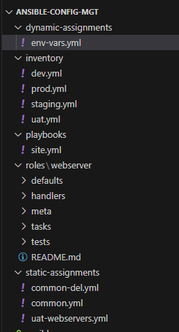
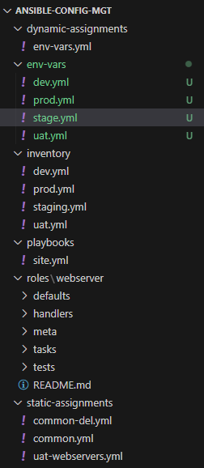

## ANSIBLE DYNAMIC ASSIGNMENTS (INCLUDE) AND COMMUNITY ROLES

---

## Introduction

Welcome to the exciting world of Ansible Dynamics, Assignments, and Community Roles! In this introduction, we will set the stage for our project, providing context, defining the purpose, and explaining why it is crucial in automation and configuratin management.

### What Does Dynamics, Assignments and Community Roles Mean

Ansible Dynamics, Assignments, and Community Roles form a comprehensive exploration into the realm of Ansible automation. This project delves into dynamic inventories, assignments, and the utilization of community roles, crucial components that elevate Ansible's capabilities.
Dynamic inventories enable the automatic discovery and updating of hosts, reducing manual intervention, also assignments allow for the efficient delegation of tasks and responsibilities within Ansible projects and community roles harness the power of shared knowledge, enabling collaboration and efficiency through pre-built Ansible roles contributed by the community.

## Importance Of Ansible Dynamics

Understanding Ansible Dynamics, Assignments, and Community Roles is an advantage in the use of ansible for configuration management. This knowledge enables organizations to automate repetitive tasks, enhance scalability, and ensure consistency across diverse environments. In the real-world, it ensures faster deployment, reduces errors, and increases collaboration among teams.

## Target Audience

This project is for DevOps engineers, and anyone eager to harness the power of Ansible for efficient automation. Familiarity with basic Ansible concepts is beneficial, making it an ideal continuation for those with introductory Ansible knowledge.

## Project Prerequisites

Before embarking on this journey, ensure you have a foundational understanding of Ansible basics. Learners must have completed the last two projects. Additionally, familiarity with version control systems like Git will enhance your learning experience.

## Project Goals

By the end of this project, learners should be proficient in leveraging dynamic inventories, assigning tasks effectively, and utilizing community roles to streamline your Ansible workflows. The goals include mastering advanced Ansible concepts, fostering collaboration through community roles, and empowering learners to apply these skills to real-world scenarios. Let's embark on this journey of Ansible empowerment together!

## Introducing Dynamic Assignment Into Our Structure

In the last project, we refactored ansible code, also assigned and imported it
1. In your https://github.com/<your-name>/ansible-config-mgt GitHub repository start a new branch and call it `dynamic-assignments`.

2. Create a new folder, name it `dynamic-assignments`. Then inside this folder, create a new file and name it `env-vars.yml`. We will instruct `site.yml` to include this playbook later. 

Your GitHub shall have following structure by now.

Note: Depending on what method you used in the previous project you may have or not have `roles` folder in your GitHub repository – if you used ansible-galaxy, then roles directory was only created on your `Jenkins-Ansible` server locally. It is recommended to have all the codes managed and tracked in GitHub, so you might want to recreate this structure manually in this case.

```
├── dynamic-assignments
│   └── env-vars.yml
├── inventory
│   └── dev
    └── stage
    └── uat
    └── prod
└── playbooks
    └── site.yml
└── roles (optional folder)
    └──...(optional subfolders & files)
└── static-assignments
    └── common.yml
```


Since we will be using the same Ansible to configure multiple environments, and each of these environments will have certain unique attributes, such as servername, ip-address etc., we will need a way to set values to variables per specific environment.

For this reason, we will now create a folder to keep each environment’s variables file. Therefore, create a new folder env-vars, then for each environment, create new YAML files which we will use to set variables.

Your layout should now look like this.

```
├── dynamic-assignments
│   └── env-vars.yml
├── env-vars
    └── dev.yml
    └── stage.yml
    └── uat.yml
    └── prod.yml
├── inventory
    └── dev
    └── stage
    └── uat
    └── prod
├── playbooks
    └── site.yml
└── static-assignments
    └── common.yml
    └── webservers.yml
```



Now paste the instruction below into the env-vars.yml file.

```
---
- name: collate variables from env specific file, if it exists
  hosts: all
  tasks:
    - name: looping through list of available files
      include_vars: "{{ item }}"
      with_first_found:
        - files:
            - dev.yml
            - stage.yml
            - prod.yml
            - uat.yml
          paths:
            - "{{ playbook_dir }}/../env-vars"
      tags:
        - always
```


## UPDATE SITE.YML WITH DYNAMIC ASSIGNMENTS


Update site.yml with dynamic assignments

Update `site.yml` file to make use of the dynamic assignment. (At this point, we cannot test it yet. We are just setting the stage for what is yet to come. So hang on to your hats)

site.yml should now look like this.

```
---
- hosts: all
- name: Include dynamic variables 
  tasks:
  import_playbook: ../static-assignments/common.yml 
  include: ../dynamic-assignments/env-vars.yml
  tags:
    - always

-  hosts: webservers
- name: Webserver assignment
  import_playbook: ../static-assignments/webservers.yml
```


## Community Roles


Now it is time to create a role for MySQL database – it should install the MySQL package, create a database and configure users. But why should we re-invent the wheel? There are tons of roles that have already been developed by other open source engineers out there. These roles are actually production ready, and dynamic to accomodate most of Linux flavours. With Ansible Galaxy again, we can simply download a ready to use ansible role, and keep going.

Download Mysql Ansible Role

We will be using a MySQL role developed by geerlingguy


Inside `roles` directory create your new MySQL role with `ansible-galaxy install geerlingguy.mysql -p .` and rename the folder to `mysql`

```
mv geerlingguy.mysql/ mysql
```

Inside `roles` directory create your new MySQL role with `ansible-galaxy install geerlingguy.nginx -p .` and rename the folder to `nginx`


```
mv geerlingguy.nginx/ nginx
```


Inside `roles` directory create your new MySQL role with `ansible-galaxy install geerlingguy.apache -p .` and rename the folder to `apache`


```
mv geerlingguy.apache/ apache
```


## LOAD BALANCER ROLES

We want to be able to choose which Load Balancer to use, Nginx or Apache, so we need to have two roles respectively:

1. Nginx
   
2. Apache


## **Important Hints:**

* Since you cannot use both **Nginx** and **Apache** load balancer, you need to add a condition to enable either one – this is where you can make use of variables.

* Declare a variable in `defaults/main.yml` file inside the Nginx and Apache roles. Name each variables `enable_nginx_lb` and `enable_apache_lb` respectively.

* Set both values to false like this `enable_nginx_lb: false` and `enable_apache_lb: false`.

* Declare another variable in both roles `load_balancer_is_required` and set its value to `false` as well

* Update both assignment and site.yml files respectively

`loadbalancers.yml` file
```
- hosts: lb
  roles:
    - { role: nginx, when: enable_nginx_lb and load_balancer_is_required }
    - { role: apache, when: enable_apache_lb and load_balancer_is_required }
```
`site.yml` file
```

     - name: Loadbalancers assignment
       hosts: lb
         - import_playbook: ../static-assignments/loadbalancers.yml
        when: load_balancer_is_required
```

Now you can make use of `env-vars\uat.yml` file to define which loadbalancer to use in UAT environment by setting respective environmental variable to `true`.

You will activate load balancer, and enable `nginx` by setting these in the respective environment’s env-vars file.

```
enable_nginx_lb: true
load_balancer_is_required: true
```

The same must work with `apache` LB, so you can switch it by setting respective environmental variable to `true` and other to `false`.


Run Playbook using:

```
ansible-playbook -i inventory/uat.yml playbooks/site.yml
```


## Real Life Scenario
Imagine you're managing a dynamic cloud infrastructure with servers coming online and offline dynamically. Traditional static inventories fall short in such scenarios. In this use case, we'll explore how Ansible Dynamics can automatically discover and update hosts in a cloud environment, ensuring that your Ansible playbooks adapt seamlessly to the changing infrastructure.

## Conclusion
From the last 2 project to this project, we have been able to learn about ansible. Ansible Dynamics, Assignments, and Community Roles offer a transformative journey in automation, equipping you with the tools to seamlessly adapt to dynamic infrastructures, delegate tasks effectively, and tap into the collective knowledge of a vibrant community. The power to automate is now at your fingertips, and the possibilities are boundless. Embrace the continuous learning journey, apply these skills to real-world scenarios, and become a catalyst for positive change in the world of automation. Happy automating!

