# Automating Infrastructure Creation With IAC (Terraform)

### Create an IAM User From The Management Console
- Create an IAM user, name it terraform, ensure that the user has only programatic access to your AWS account (make sure not to grant console access) and grant this user AdministratorAccess permissions.

- Copy the secret access key and access key ID. Save them in a notepad temporarily.(It will be used later to configue aws from the command line)

  <table>
  <tr>
    <td>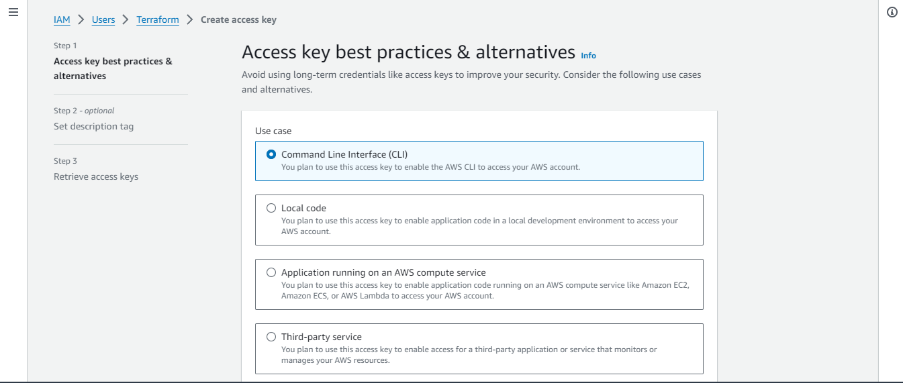</td>
    <td>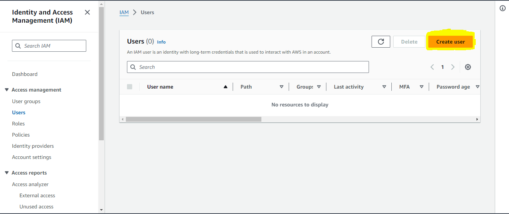</td>
    <td>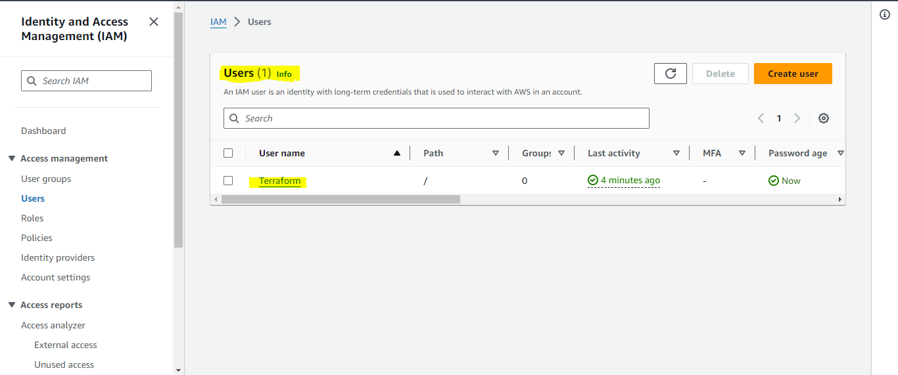</td>
  </tr>
</table>

### Install Python3 on Your Local Machine
If you are using a linux or windows machine, python comes pre-installed 
**For `Windows` machine**
```
Visit the official Python website at python.org.
Navigate to the "Downloads" section.
Click on the "View the full list of downloads" link.
Scroll down to find the version of Python you want to install. As of my last knowledge update in January 2022, the latest stable version is Python 3.x (e.g., Python 3.9).
Choose the version that suits your needs (you might see options for the latest version and the latest version for a specific operating system, such as Windows).
Click on the link to download the installer.
Verify installation with `python --version or python3 --version
```
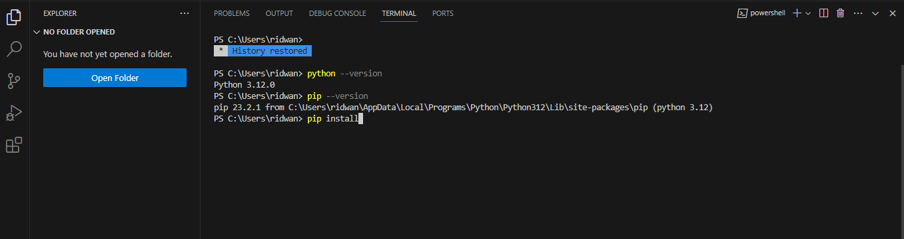

- Install boto3 with python-pip

      pip install boto3
**The above command will work on windows, linux and mac**


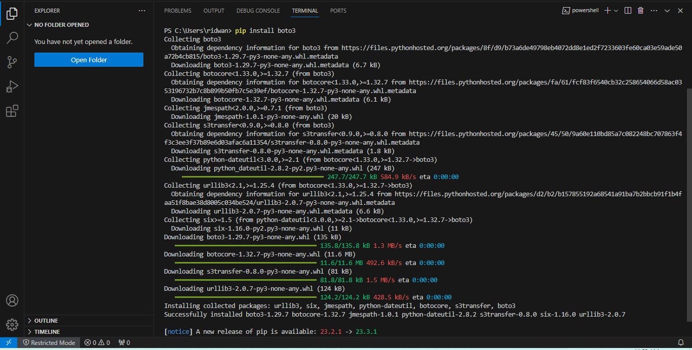


### Install AWS CLI On Your Local Machine

To install AWS CLI, follow this [official documentation](https://docs.aws.amazon.com/cli/latest/userguide/getting-started-install.html)

After installation, we to use aws cli to configure teraform IAM user to access the aws console from the command line using terraform as IaC

      aws configure

Alternatively, you can create the credentials file yourself. By default, its location is ~/.aws/credentials. At a minimum, the credentials file should specify the access key and secret access key. In this example, the key and secret key for the account are specified in the default profile:

```
Aws Access Key ID = YOUR_ACCESS_KEY
Aws Secret Access Key = YOUR_SECRET_KEY
Default region name = YOUR_REGION
Default output format = json
```

### VPC | SUBNETS | SECURITY GROUPS

Let us create a directory structure

Open your Visual Studio Code and:

- Create a folder called `PBL`
- Create a file in the folder, name it `main.tf`
- 
Your setup should look like this.

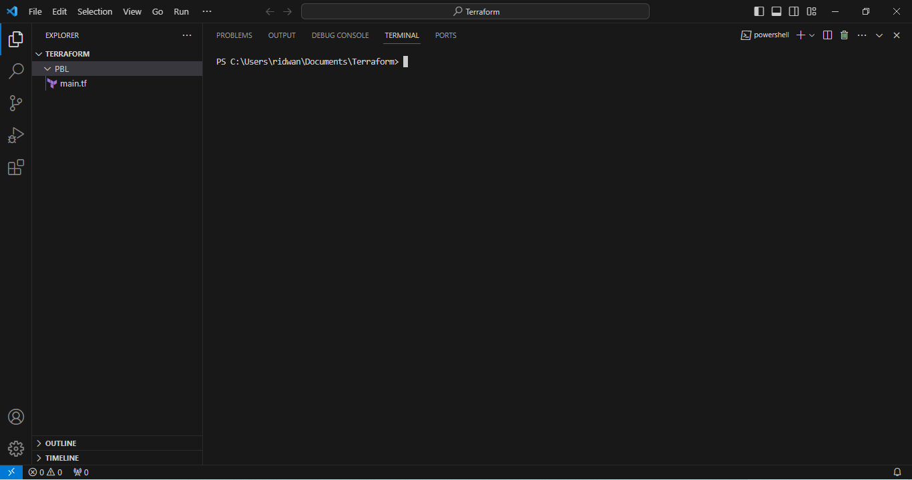

### Install Terraform

To set up terraform cli, follow the [official documentation](https://developer.hashicorp.com/terraform/tutorials/aws-get-started/install-cli)

After installation, run `terraform version` to verify successful installation of terraform.

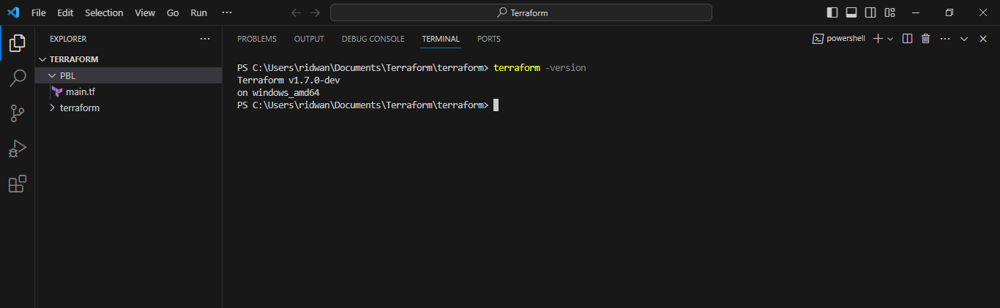


### Provider and VPC resource section

- Add AWS as a provider, and a resource to create a VPC in the main.tf file.

- Provider block informs Terraform that we intend to build infrastructure within AWS.

- Resource block will create a VPC.

Note: You can change the configuration above to create your VPC in other region that is closer to you. The same applies to all configuration snippets that will follow.

- The next thing we need to do, is to download necessary plugins for Terraform to work. These plugins are used by providers and provisioners.  So, Terraform will just download plugin for AWS provider.

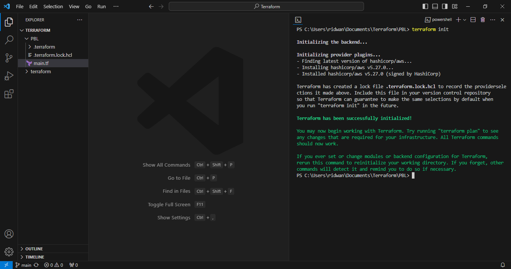

- Notice that a new directory has been created: .terraform.... This is where Terraform keeps plugins. Generally, it is safe to delete this folder. It just means that you must execute terraform init again, to download them.

In our main.tf file, let us create a vpc with aws as our provider.

```
provider "aws" {
  region = "us-east-1"
}

# Create VPC
resource "aws_vpc" "main" {
  cidr_block                     = "172.31.0.0/16"
  enable_dns_support             = "true"
  enable_dns_hostnames           = "true"
}
```

- Moving on, let us create the only resource we just defined. aws_vpc. But before we do that, we should check to see what terraform intends to create before we tell it to go ahead and create it.

- Run terraform plan

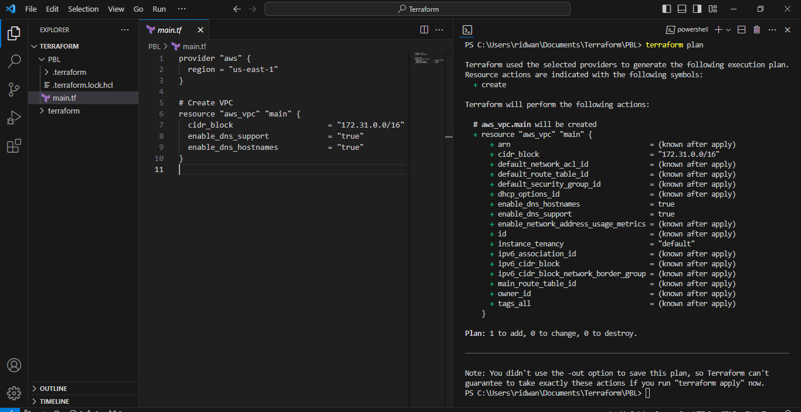

- Then, if you are happy with changes planned, execute terraform apply

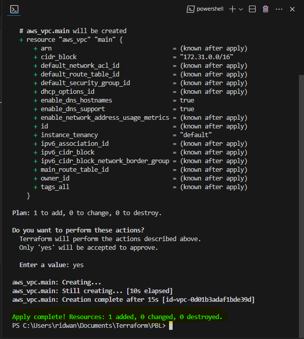


According to our architectural design, we require 6 subnets:

- 2 public
- 2 private for webservers
- 2 private for data layer
- 
Let us create the first 2 public subnets.

Add below configuration to the main.tf file:

```
# Create public subnets1
    resource "aws_subnet" "public1" {
    vpc_id                     = aws_vpc.main.id
    cidr_block                 = "172.31.0.0/20"
    map_public_ip_on_launch    = true
    availability_zone          = "us-east-1a"

}

# Create public subnet2
    resource "aws_subnet" "public2" {
    vpc_id                     = aws_vpc.main.id
    cidr_block                 = "172.31.16.0/20"
    map_public_ip_on_launch    = true
    availability_zone          = "us-east-1b"
}
```

We are creating 2 subnets, therefore declaring 2 resource blocks – one for each of the subnets. We are using the vpc_id argument to interpolate the value of the VPC id by setting it to aws_vpc.main.id. This way, Terraform knows inside which VPC to create the subnet. Run terraform plan and terraform apply

Observations:

Hard coded values: Remember our best practice hint from the beginning? Both the availability_zone and cidr_block arguments are hard coded. We should always endeavour to make our work dynamic. Multiple Resource Blocks: Notice that we have declared multiple resource blocks for each subnet in the code. This is bad coding practice. We need to create a single resource block that can dynamically create resources without specifying multiple blocks. Now let us improve our code by refactoring it.

First, destroy the current infrastructure. Since we are still in development, this is totally fine. Otherwise, DO NOT DESTROY an infrastructure that has been deployed to production.

To destroy whatever has been created run terraform destroy command, and type yes after evaluating the plan.


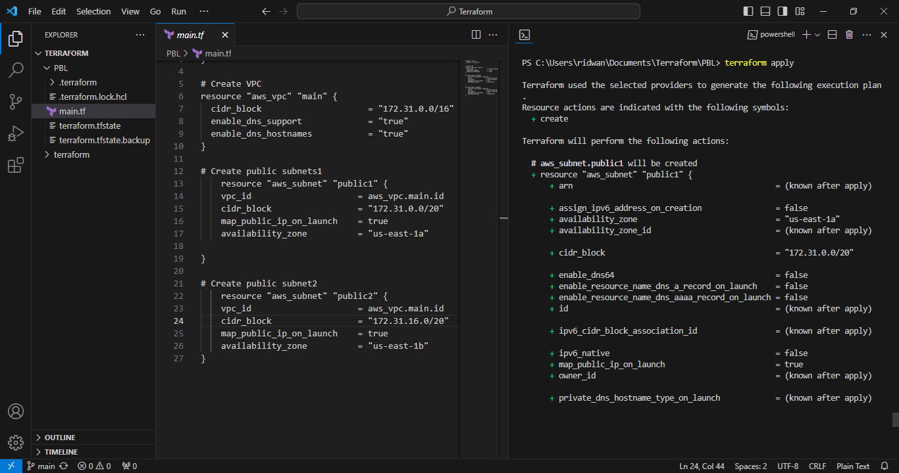


# FIXING THE PROBLEMS BY CODE REFACTORING

Starting with the provider block, declare a variable named region, give it a default value, and update the provider section by referring to the declared variable.

```
    variable "region" {
        default = "us-east-1"
    }

    variable "vpc_cidr" {
        default = "172.31.0.0/16"
    }

    variable "enable_dns_support" {
        default = "true"
    }

    variable "enable_dns_hostnames" {
        default ="true" 
    }

    variable "enable_classiclink" {
        default = "false"
    }

    variable "enable_classiclink_dns_support" {
        default = "false"
    }

    provider "aws" {
    region = var.region
    }

    # Create VPC
    resource "aws_vpc" "main" {
    cidr_block                     = var.vpc_cidr
    enable_dns_support             = var.enable_dns_support 
    enable_dns_hostnames           = var.enable_dns_support
    enable_classiclink             = var.enable_classiclink
    enable_classiclink_dns_support = var.enable_classiclink

    }
```

We are just going to introduce some interesting concepts. Loops & Data sources

Terraform has a functionality that allows us to pull data which exposes information to us. Let us fetch Availability zones from AWS, and replace the hard coded value in the subnet’s availability_zone section.

```
# Get list of availability zones
data "aws_availability_zones" "available" {
  state = "available"
}
```
To make use of this new data resource, we will need to introduce a count argument in the subnet block: Something like this.

```
# Create public subnet1
resource "aws_subnet" "public" { 
    count                   = 2
    vpc_id                  = aws_vpc.main.id
    cidr_block              = "172.31.0.0/20"
    map_public_ip_on_launch = true
    availability_zone       = data.aws_availability_zones.available.names[count.index]

}
```

But we still have a problem. If we run Terraform with this configuration, it may succeed for the first time, but by the time it goes into the second loop, it will fail because we still have cidr_block hard coded. The same cidr_block cannot be created twice within the same VPC. So, we have a little more work to do.

We will introduce a function cidrsubnet() to make this happen. It accepts 3 parameters.

```
  # Create public subnet1
  resource "aws_subnet" "public" { 
      count                   = 2
      vpc_id                  = aws_vpc.main.id
      cidr_block              = cidrsubnet(var.vpc_cidr, 4 , count.index)
      map_public_ip_on_launch = true
      availability_zone       = data.aws_availability_zones.available.names[count.index]

  }
```

We can introuduce length() function, which basically determines the length of a given list, map, or string.

Since data.aws_availability_zones.available.names returns a list like ["us-east-1a", "us-east-1b", "us-east-1c"] we can pass it into a lenght function and get number of the AZs.

Now we can simply update the public subnet block like this

# Create public subnet1

```
resource "aws_subnet" "public" { 
    count                   = length(data.aws_availability_zones.available.names)
    vpc_id                  = aws_vpc.main.id
    cidr_block              = cidrsubnet(var.vpc_cidr, 4 , count.index)
    map_public_ip_on_launch = true
    availability_zone       = data.aws_availability_zones.available.names[count.index]

}
```

Observations:

What we have now, is sufficient to create the subnet resource required. But if you observe, it is not satisfying our business requirement of just 2 subnets. The length function will return number 3 to the count argument, but what we actually need is 2. Now, let us fix this.

Declare a variable to store the desired number of public subnets, and set the default value


```
variable "preferred_number_of_public_subnets" {
  default = 2
}
```

Next, update the count argument with a condition. Terraform needs to check first if there is a desired number of subnets. Otherwise, use the data returned by the lenght function. See how that is presented below.


# Create public subnets


```
# Create public subnets
resource "aws_subnet" "public" {
  count  = var.preferred_number_of_public_subnets == null ? length(data.aws_availability_zones.available.names) : var.preferred_number_of_public_subnets   
  vpc_id = aws_vpc.main.id
  cidr_block              = cidrsubnet(var.vpc_cidr, 4 , count.index)
  map_public_ip_on_launch = true
  availability_zone       = data.aws_availability_zones.available.names[count.index]

}
```

Now lets break it down:

- The first part var.preferred_number_of_public_subnets == null checks if the value of the variable is set to null or has some value defined.
- The second part ? and length(data.aws_availability_zones.available.names) means, if the first part is true, then use this. In other words, if preferred number of public subnets is null (Or not known) then set the value to the data returned by lenght function.
- The third part : and var.preferred_number_of_public_subnets means, if the first condition is false, i.e preferred number of public subnets is not null then set the value to whatever is definied in var.preferred_number_of_public_subnets
  
Now the entire configuration should now look like this

```
# Get list of availability zones
data "aws_availability_zones" "available" {
state = "available"
}

variable "region" {
      default = "us-east-1"
}

variable "vpc_cidr" {
    default = "172.31.0.0/16"
}

variable "enable_dns_support" {
    default = "true"
}

variable "enable_dns_hostnames" {
    default ="true" 
}

variable "enable_classiclink" {
    default = "false"
}

variable "enable_classiclink_dns_support" {
    default = "false"
}

  variable "preferred_number_of_public_subnets" {
      default = 2
}

provider "aws" {
  region = var.region
}

# Create VPC
resource "aws_vpc" "main" {
  cidr_block                     = var.vpc_cidr
  enable_dns_support             = var.enable_dns_support 
  enable_dns_hostnames           = var.enable_dns_support
  enable_classiclink             = var.enable_classiclink
  enable_classiclink_dns_support = var.enable_classiclink

}

# Create public subnets
resource "aws_subnet" "public" {
  count  = var.preferred_number_of_public_subnets == null ? length(data.aws_availability_zones.available.names) : var.preferred_number_of_public_subnets   
  vpc_id = aws_vpc.main.id
  cidr_block              = cidrsubnet(var.vpc_cidr, 4 , count.index)
  map_public_ip_on_launch = true
  availability_zone       = data.aws_availability_zones.available.names[count.index]

}
```


# Introducing variables.tf & terraform.tfvars

We will put all variable declarations in a separate file

And provide non default values to each of them

- Create a new file and name it variables.tf
- Copy all the variable declarations into the new file.
- Create another file, name it terraform.tfvars
- Set values for each of the variables.

## Maint.tf

```
# Get list of availability zones
data "aws_availability_zones" "available" {
state = "available"
}

provider "aws" {
  region = var.region
}

# Create VPC
resource "aws_vpc" "main" {
  cidr_block                     = var.vpc_cidr
  enable_dns_support             = var.enable_dns_support 
  enable_dns_hostnames           = var.enable_dns_support
  enable_classiclink             = var.enable_classiclink
  enable_classiclink_dns_support = var.enable_classiclink

}

# Create public subnets
resource "aws_subnet" "public" {
  count  = var.preferred_number_of_public_subnets == null ? length(data.aws_availability_zones.available.names) : var.preferred_number_of_public_subnets   
  vpc_id = aws_vpc.main.id
  cidr_block              = cidrsubnet(var.vpc_cidr, 4 , count.index)
  map_public_ip_on_launch = true
  availability_zone       = data.aws_availability_zones.available.names[count.index]
}
```

## variables.tf

```
variable "region" {
      default = "us-east-1"
}

variable "vpc_cidr" {
    default = "172.31.0.0/16"
}

variable "enable_dns_support" {
    default = "true"
}

variable "enable_dns_hostnames" {
    default ="true" 
}

variable "enable_classiclink" {
    default = "false"
}

variable "enable_classiclink_dns_support" {
    default = "false"
}

  variable "preferred_number_of_public_subnets" {
      default = null
}
```

## terraform.tfvars

```
region = "us-east-1"

vpc_cidr = "172.31.0.0/16" 

enable_dns_support = "true" 

enable_dns_hostnames = "true"  

enable_classiclink = "false" 

enable_classiclink_dns_support = "false" 

preferred_number_of_public_subnets = 2
```


 <table>
  <tr>
    <td>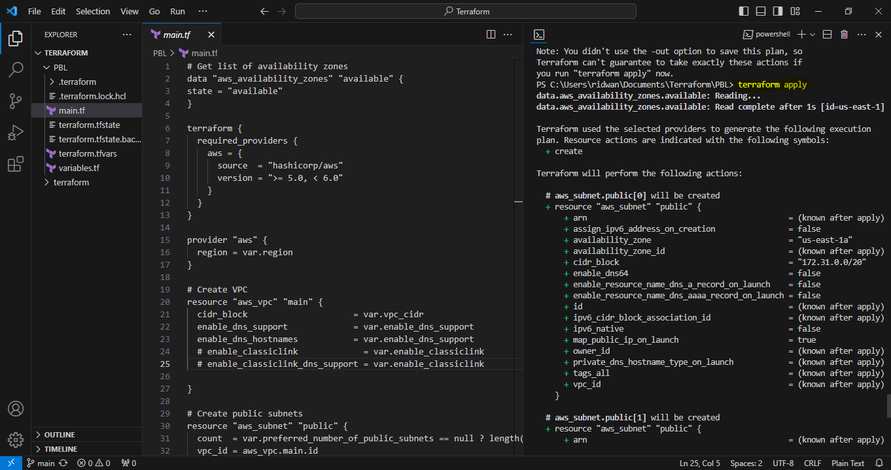</td>
    <td>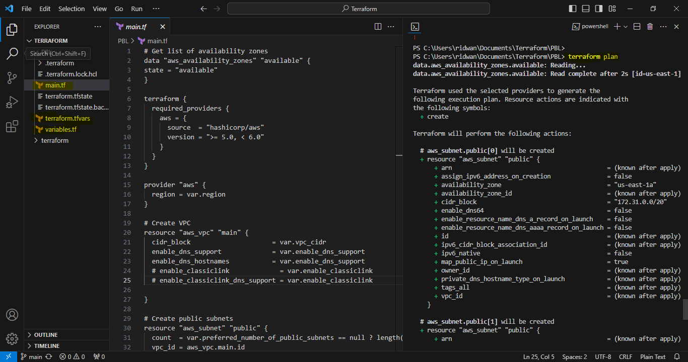</td>
  </tr>
</table>
