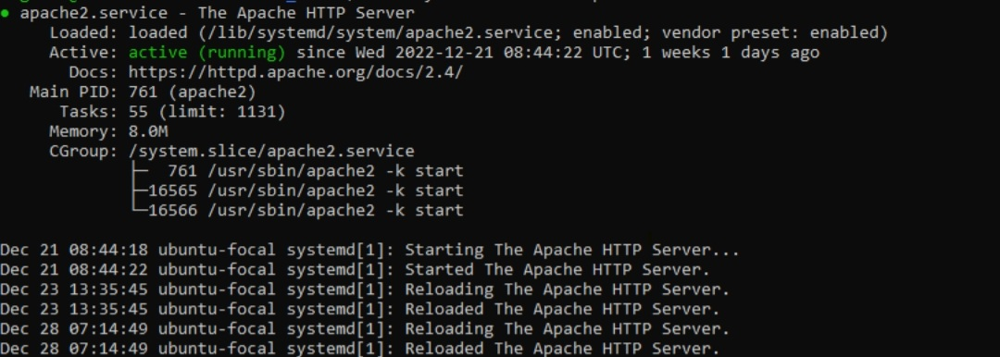

# Web Stack Implementation (LAMP Stack) In AWS

# Introduction

In the constantly changing world of software development, picking the right technology stack is crucial for the success or failure of a project. The "Web Stack" project is a program for people who want to learn how to make and launch web applications. This course teaches you how to create a type of web stack that work on all operating systems and allow users to interact with them. You will learn about the latest technology used to build these websites.

This project focuses on exploring how different web development tools and frameworks can work together effectively. It aims to teach people how to create a LAMP stack and deploy static pages onto the stack. We will begin by looking at the main parts and structure of this new web system. Through this, learners will learn about the benefits and possibilities of using these different software technologies together.

### What is Web Stack ?
A simple meaning of web in any interconnected things. A stack on the other hand is a collection of similar things or objects which are together.
A web stack is a collection of similar things or object (softwares) which work together in an interconnected way to run a function. There are different types of web stack and they all perform different function. There are different types of web stacks which are;
- **LAMP** (Linux, Apache, MySQL, PHP or Python, or Perl)
- **LEMP** (Linux, Nginx, MySQL, PHP or Python, or Perl)
- **MERN** (MongoDB, ExpressJS, ReactJS, NodeJS)
- **MEAN** (MongoDB, ExpressJS, AngularJS, NodeJS)

These stacks all have diferent function. In this project, we will be focusing on LAMP Stack

**i. LAMP Stack**

The word LAMP refers to a group of open source software installed together which can be used to host web applications. The stack consists of four software technologies which are linux, a database, an hypertext processor and a web sever that is not capable of load balancing and reverse proxy
***LAMP*** meaning Linux; a unix operating system, Apache; a web server, Mysql; a database and PHP; an Hypertext preprocessor.

### Importance of Using LAMP Stack

- LAMP is a popular and flexible web development platform that supports many websites and web applications. If you understand LAMP, you can create web solutions that are interactive, have many features, and can handle a lot of traffic.
- All parts of the LAMP stack are free for anyone to use and contribute to, which encourages people to work together in building websites and web applications. This not only saves money but also promotes working together and coming up with new ideas.
- LAMP is used by many different industries. It is important for web developers, system administrators, and IT professionals to know about it.
- LAMP includes both the skills needed for the part of a website that users see (HTML, PHP) and the skills needed for the behind-the-scenes part of a website (Linux, Apache, MySQL). LAMP provides a complete view of web development.
- Entrepreneurs who want to start their own web-based businesses or digital projects without relying too much on specialized technologies find LAMP skills very useful.

### Target Audience

This project is for devops engineers who wants to become proficient in software deployment, particularly those seeking to deploy dynamic web applications but are not limited to;
- System administrator
- Site Reliability Engineers

### Prerequisite
- An AWS account. [Click here](https://portal.aws.amazon.com/billing/signup#/start/email) to create a free account
- Access to a terminal or a virtual machine
- Knowledge of linux
- SSH [Click here](https://www.digitalocean.com/community/tutorials/how-to-set-up-ssh-keys-on-ubuntu-20-04) to kearn more on ssh keys

### Goals
By the end of this project, learners should be able to setup a LAMP Stack and deploy a static php page.

# Getting Started With LAMP Stack

#### Step 1: Launch Ubuntu Instance and SSH Into From Your Terminal
**i. Sign in to your AWS account**

**ii. On the top right select services and search for ***Elastic Cloud Compute (EC2).*****

**iii. From the menu on the left side, select ***instances.*****
**iv. Select ***launch instance*** on the top right side.***
 **v. Follow the gif below to finish lauching an instance**

**Important**: Be sure to launch an Ubuntu 20.04LTS instance. Also keep your .pem key safely. Once it is lost, you will not be able to ssh into the instance again. Also, anyone with the key can have access to your instance

**SSH into your ubuntu instance**
- For windows, open command promot or powershell

      ssh -i path/to/.pem ubuntu@public_ip_address

- For mac and linux, open a terminal

      ssh -i path/to/.pem ubuntu@public_ip_address

**Note:** path/to/.pem should be replaced with the path to the ssh .pem key the was download when creating the instance and public_ip_address should be replaced the actual ubuntu instance public ip address

#### Step 2: Installation of Apache
In the previous step, we were able to create and instance and ssh into the instance
update apt repositories

    sudo apt update
Install apache web server

    sudo apt install apache2
Allow firewall for apache

    sudo ufw allow in "Apache"
NOTE: The step above will allow firewall for apache once it is enabled, it is important we allow firewall for ssh. ssh runs on port 22, if firewall is not allowed for ssh running on port 22, connection to the ubuntu instance via ssh will be permanently denied

    sudo ufw allow 22
    
To check if apache web server has been installed successfully

    sudo systemctl status apache2

To access your web server on your browser

    http://ubuntu_instance_public_ip_address

The Apache default page above will displayed. 
You can check your ubuntu instance ip address from your aws console from the EC2 instance service management or input the command below

    curl http://icanhazip.com

#### Step 2: Installation of Mysql

In the previous step, apache web server installed successfully. In this step, mysql will be installed as a database to store data for our web application.
apt repositories has been updated in the previous step, mysql should be installed directly

    sudo apt install mysql-server
Secure mysql installation 

    sudo mysql_secure_installation
Check if mysql has been successfully installed

    sudo systemctl status mysql 

Log into mysql as the root user

    sudo mysql
Log out of mysql

    mysql>exit

## Installing PHP

So far, Apache and Mysql has been installed. The last software of the LAMP stack which is PHP will be installed in this step

    sudo apt install php libapache2-mod-php php-mysql
Check for the successful installation of php

    php -v

## Configuring Apache Web Server To Serve As A Virtual Host 
Create a directory for our codes to be hosted at the location "/var/www/html/darey.io", "darey.io" can be named any name. The directory will contain the php codes which apache will serve. The codes are not limited to php codes but also html, css, javascript e.t.c. . Apache web server is smart enough to know this location and serve it with the help of its configuration file.

    sudo mkdir /var/www/html/darey.io
Create an simple html file which our apache will serve

    sudo nano /var/www/darey.io/index.html
It should have the content below

    <h1>Welcone to Darey.io, Apache works</h1>
darey.io is the directory created which will contain our php code
Assign ownership of the directory with the user

    sudo chown -R $USER:$USER /var/www/html/darey.io

Create a new configuration file that will replace apache default configuration file at /etc/apache2/sites-available

    sudo nano /etc/apache2/sites-available/darey_io.conf

darey_io contains the below

    #<VirtualHost *:80>
          ServerName localhost
          ServerAlias localhost
          ServerAdmin webmaster@localhost
          DocumentRoot /var/www/html/darey.io
          ErrorLog ${APACHE_LOG_DIR}/error.log
          CustomLog ${APACHE_LOG_DIR}/access.log combined
    </VirtualHost>

Enable the new .conf and disabled default.conf file

    sudo a2ensite /etc/apache2/sites-available/darey_io.conf

    sudo a2dissite /etc/apache2/sites-available/000-default
Reload apache conf. file to make sure the file has no errors

    sudo apache2ctl configtest

Reload apache 

    sudo systemctl reload apache2

Check your web browser.

    http://ubuntu_instance_public_ip_address

## Modifying Directory Index To Serve php files

By default, in the index.html comes before index.php1 file in /etc/apache2/mods-enabled/dir.conf. As a result of this, apache will always serve html files before php file. The directory index needs to be modified to apache read php files

    sudo nano /etc/apache2/mods-enabled/dir.conf
Change the arrangement if index.html and index.php

    <IfModule mod_dir.c>
        DirectoryIndex index.php index.html index.cgi index.pl index.xhtml index.htm
    </IfModule>
Save and close the file then reload apache

    sudo systemctl reload apache2

## Testing PHP with Apache 

Replace the index.html file in /var/www/html/darey.io with index.php with a simple php info.

    sudo nano /var/www/html/darey.io/index.php
Paste the contents below

    <?php
    phpinfo();
Save and close the file 
You can use ubuntu instance public ip address to access the php file served by apache from your web browser 

The default page above will be displayed.
## Testing PHP and Mysql with Apache (LAMP Stack)

In the previous step, php was tested with apache by using apache to serve a php file. In the step mysql database will be connected to php and web served by apache.
The first to do is to create a database with datas

Log into mysql as root user 

    sudo mysql 

***In the mysql shell***
Create a database called darey_io

    CREATE DATABASE darey_io;

Create a new user called ***darey*** with password ***A different username or password can be used***

    CREATE USER 'darey'@'%' IDENTIFIED WITH mysql_native_password BY 'Ab123456789';
Grant 'darey' all permissions 

    GRANT ALL ON root.* TO 'darey'@'%';
Log out of mysql

    exit
Log in to mysql as user 'darey'

    mysql -u darey -p Aa123456789

Checkout the database created as the root user

    SHOW DATABASES;
The output below will be printed

    +--------------------+
    | Database           |
    +--------------------+
    | darey_io           |
    | information_schema |
    +--------------------+
    2 rows in set (0.000 sec)
Create a table called devops_list in the database created 

    CREATE TABLE darey_io.devops_list (
	item_id INT AUTO_INCREMENT,
	content VARCHAR(255),
	PRIMARY KEY(item_id)
    );
Add a few lines to the list

    INSERT INTO darey_io.devops_list (content) VALUES ("Linux needed for devops");
    INSERT INTO darey_io.devops_list (content) VALUES ("Git needed for devops");
    INSERT INTO darey_io.devops_list (content) VALUES ("LAMP needed for devops");

Check that the lines have been successfully inputed

    SELECT * FROM darey_io.devops_list;
To output below will be shown 

    +---------+--------------------------+
    | item_id | content                  |
    +---------+--------------------------+
    |       1 | Linux needed for devops  |
    |       2 | Git needed for devops    |
    |       3 | LAMP needed for devops   |
    +---------+--------------------------+
    3 rows in set (0.000 sec)
Exit mysql shell.

In the /var/www/html we need to edit our index.php file

    sudo nano /var/www/html/index.php
Paste the content below 

    <?php
    $user = "darey";
    $password = "Ab123456789";
    $database = "darey_io";
    $table = "devops_list";
    
    try {
    $db = new PDO("mysql:host=localhost;dbname=$database", $user, $password);
    echo "<h2>Devops</h2><ol>"; 
    foreach($db->query("SELECT content FROM $table") as $row) {
    echo "<li>" . $row['content'] . "</li>";
    }
    echo "</ol>";
    } catch (PDOException $e) {
    print "Error!: " . $e->getMessage() . " ";
    die();
    }
Save and close the file
Check you web browser with your ubuntu instance ip address to see apache serving php with the contents in the database displayed.
