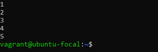
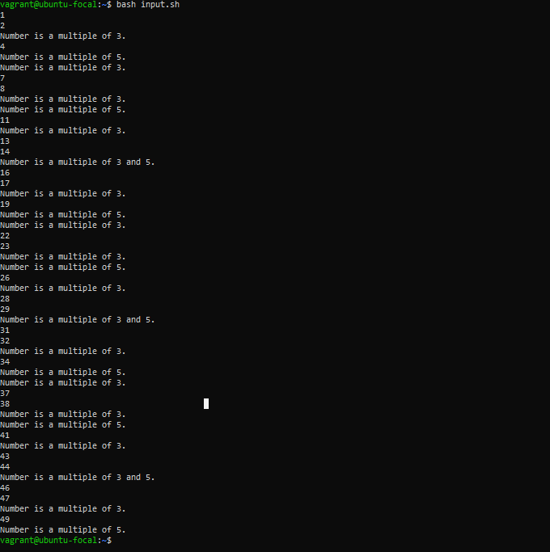

# Shell Scripting 

# Introdution To Shell Scripting

Think about you working for a big orginisation. In this organisation, you are tasked with deploying a software everyday on nginx or backing up files and storing them in a remote location. In order to make the task easier, we can use a script.

In a simple explanation, a script is any set of instructions that eliminates manual repetitive task and automates it. There are different types of scripting languages but there are three major scripting langauges in the world of devops which are 
- Shell script
- Python script
- Javascript

In this project, we will be focusing on shell scripting.

### What Is Shell Scripting
Shell scripting is the process of writing and executing a series of instructions in a shell to automate tasks. A shell script is essentially a script or program written in a shell language, such as Bash, sh, zsh, or PowerShell ?

**What Is a Shebang or Hashbang (#!/bin/bash)**
At the beginning of a script, is a ***shebang or hashbang***. It is a special notation used in Unix-like operating systems, to specify the interpreter that should be used to execute the script. In this case, #!/bin/bash specifically indicates that the Bash shell should be used to interpret and execute the script.

 The #! (pronounced as "shebang" or "hashbang"): This character sequence tells the operating system that what follows is the path to the interpreter that should be used to execute the script.

/bin/bash: This is the absolute path to the Bash shell executable. It tells the system to use the Bash interpreter located at /bin/bash to run the script.

When a script with a shebang line like #!/bin/bash, the operating system looks for the specified interpreter (in this case, Bash) and uses it to execute the script. 

Without a shebang line, the system may not know how to interpret and execute the script, and you may need to explicitly specify the interpreter when running the script. 

### Why Is Shell Scripting Important

Shell scripting is very important in technology and industry because it allows you to automate a lot of tasks. This includes things like regularly backing up files and setting up complicated system settings. Imagine a data center where people in charge need to make copies of important databases every day. If we didn't use shell scripting, this task would take a long time and there would be a higher chance of mistakes. However, using shell scripts, these backups can be automated, scheduled, and done without humans, which makes sure the data is secure and saves time for IT staff to work on other important tasks.
Shell scripting is essential for managing and taking care of servers in system administration. For example, in a big web hosting setting, the people in charge must make sure that many servers work well together. By writing code for regular maintenance tasks such as log rotation, software updates, and user management, they can efficiently and consistently handle these tasks for all the servers. This helps to decrease the possibility of mistakes made by humans and improves the reliability of the system.

Shell scripting has a big effect that goes beyond just data centers and server farms. It also applies to creating and improving software, where special codes are used to automatically test, deploy, and combine different software parts together. In simpler words, using shell scripting not only makes software development faster but also makes sure that deployments are reliable and consistent. This directly impacts the delivery of good quality software to users.

Shell scripting helps businesses and technology industries by allowing them to automate and manage different tasks. This improves productivity and makes operations more efficient, which helps save money in the real world.

### Target Audience

i. DevOps Engineers: DevOps professionals need to know shell scripting to create and manage automation scripts in CI/CD pipelines, container orchestration, and infrastructure as code (IaC) practices.

ii. System administrators need to learn shell scripting in order to make their jobs easier. Shell scripting helps them automate repetitive tasks, control servers, and guarantee that the system is secure and running smoothly.

iii. QA Engineers can use shell scripting to make testing easier and faster, which means they don't have to do as much testing by hand.

iv. IT support and operations teams utilize shell scripting to fix problems, keep an eye on systems, and do regular maintenance to make sure the systems work at their best.

### Prerequisite 

Learners need to have;

i. Prior knowledge of the command line interface

ii. Understanding of linux commands especially to grant file permissions. Learn more about [linux](http://linuxcommand.org/lc3_lts0020.php).

iii.Ability to use text editors like nano, vim and emacs.

# Project Highlight

- Shell Scripting 
- Introduction To Shell Scripting
  - What Is Shell Scripting
    - What is a shebang or hashbang
  - Why is Shell Scripting Important
  - Target Audiene
  - Prerequisites

- Getting Started With Shell Scripting
  - Syntax For a Shell Script
  - Variables and Values
  - Control Flow
  - Working With Shell Scripts
    - Input and Output
    - Directory Manipulation and Navigation
    - File Operation and Sorting
    - File Backup and Stamping
    - Control Flow
 
- Real-World Scenarios of Shell Scripting
- Conclusion

### Syntax For a Shell script
Every line of a bash file starts with a shebang 
   
    #!/bin/bash
Execute a bash script assuming the file containing the script is darey

    ./darey.sh
Note: all bash file are always ending with an extension .sh
Also, darey.sh must be an executable file before it can be executed

    sudo chmod u+x darey.sh
 The command above make darey.sh an executable file

 An alternative for executing a bash script

    bash darey.sh 

**- Variables:** Bash allows you to define and work with variables. Variables can store data of various types such as numbers, strings, and arrays. You can assign values to variables using the = operator, and access their values using the variable name preceded by a $ sign.
Example: Assigning value to a variable:

name="John" 

 A variable usually takes a value, in other words, a variabe stores a value. A value can be a character, number, string or array a value is assigned to a variable.

 From the example above, "John" was asigned to the variable "name". In the next example, we would see how the variable name saved a value
 
Example: Retrieving value from a variable:

echo $name

echo is a command used to print a text, variables or values.
In this example, echo is used to print a variable which stores a value .

**- Control Flow:** Bash provides control flow statements like if-else, for loops, while loops, and case statements to control the flow of execution in your scripts. These statements allow you to make decisions, iterate over lists, and execute different commands based on conditions.
Example: Using if-else to execute script based on a conditions

#!/bin/bash

read -p "Enter a number: " num

if [ $num -gt 0 ]; then
    echo "The number is positive."
elif [ $num -lt 0 ]; then
    echo "The number is negative."
else
    echo "The number is zero."
fi
The piece of code prompts you to type a number and prints a statement stating the number is positive or negative.

The read command in the script above takes input (a number) from the user
The second line starting with an if statement tells that if the number inputed by the user is greater than 0, the third line should print "This number is positive" using the echo command
The fourth line starting with an elif statement tells that if the number inputed by the user is less than 0, the fifth line should print "The number is negative" using the echo command
The sixth line starting with an else statement tells that if the number inputed by the user is 0, the seventh line should print "The number is zero" using the echo command

Example: Iterating through a list using a for loop

#!/bin/bash

for (( i=1; i<=5; i++ ))
do
    echo $i
done

Result of the for loop:

### Working With Shell Scripts

1. Input and output

       echo "enter your name:"
       read name
       echo "Hi $name, it nice to know you"

- The first line in the script above shows a text telling the user to input his name
- The second takes input from the user
- The third line outputs the input take from the user.

  

  
2 Directory Manipulation and Navigation.

    #!/bin/bash
    echo "Current directory: $PWD"
    echo "creating a new directory ..."
    mkdir darey_io 
    echo "darey_io created"
    echo "changing to new directory"
    cd darey_io
    echo "Current directory: $PWD"
    echo "creating files"
    touch bash1.txt
    touch bash2.txt
    echo "Files created"
    echo "Files in the current directory:"
    ls
    echo "Moving back to previous directory"
    cd ..
    echo "Current directory: $PWD"
    echo "Removing the new directory"
    rm -rf darey_io
    echo "Directory removed."
    echo "Files in the current directory:"
    ls
 The script above;
- Prints the current directory.
- Creates a directory called "darey_io."
- Changes to the "darey_io" directory.
- Prints the current directory (which should be inside "darey_io").
- Creates two empty files in the "darey_io" directory.
- Lists the files in the current directory (inside "darey_io").
- Moves back to the previous directory.
- Prints the current directory (which should be the original directory).
- Removes the "darey_io" directory and its contents.
- Lists the files in the current directory (after removing "darey_io").

  

   
3. File Operations and Sorting

       #!/bin/bash

       # Creating three files
       echo "Creating non empty files..."
       echo "This is bash3." > bash3.txt
       echo "This is bash2." > bash2.txt
       echo "This is bash1" > bash1.txt
       echo "Bash 1, 2 and 3 has been successfully created"

        # Sorting the files alphabetically
        echo "sorting files alphabetically..."
        ls | sort > sorted_files.txt
        echo "Files sorted."

        # Display the sorted files
        echo "Sorted files:"
        cat sorted_files.txt

        # Remove the original files
        echo "Removing the files..."
        rm bash1.txt bash2.txt bash3.txt
        echo "original files removed."

         # Rename the sorted file to a more descriptive name
         echo "Renaming sorted file..."
         mv sorted_files.txt sorted_file_sorted_alphabetically.txt
         echo "File renamed"

         # Display the final sorted file
         echo "Final sorted file:"
         cat sorted_file_sorted_alphabetically.txt

The script above;
- Creates three non-empty text files: bash1.txt, bash2.txt, and bash3.txt.
- It sorts the files in the current directory alphabetically and saves the sorted list to a file named sorted_files.txt.
- It displays the sorted file names.
- Removes the original bash1.txt, bash2.txt, and bash3.txt files.
- Renames the sorted file (sorted_files.txt) to sorted_file_sorted_alphabetically.txt.
- Displays the contents of the renamed file, which should contain the sorted list of file names.

4. File Backup and Timestamping

        #!/bin/bash
   
        # Define the source directory and backup directory
        source_dir="/path/to/source_directory"
        backup_dir="/path/to/backup_directory"

        # create a timestamp with the current date and time
        timestamp=$(date +"%Y%m%d%H%M%S")

       # Create a backup directory with the timestamp
        backup_dir_with_timestamp="$backup_dir/backup_$timestamp"

        # Create the backup directory
        mkdir -p "$backup_dir_with_timestamp"

        # Copy all files from the source directory to the backup directory
        cp -r "$source_dir"/* "$backup_dir_with_timestamp"

        # Display a message indicating the backup process is complet
        echo "Backup completed. Files copied to: $backup_dir_with_timestamp"

   In the first comment section of the script, the source directory and backup directory are defined. You should replace "/path/to/source_directory" and "/path/to/backup_directory" with the actual paths to your source and backup directories.
   
   For the second comment section, it generates a timestamp using the date command. The +%Y%m%d%H%M%S format represents the year (4 digits), month (2 digits), day (2 digits), hour (24-hour format, 2 digits), minute (2 digits), and second (2 digits).
In the third comment section, a new backup directory path is created by appending the generated timestamp to the specified backup directory path. The result will be a directory name like "backup_YYYYMMDDHHMMSS" inside the backup directory.

The fourth comment section creates the backup directory specified by backup_dir_with_timestamp. The -p option ensures that parent directories are created if they don't exist.

Using the cp command, all files from the source directory ($source_dir) are recursively copied (-r) to the backup directory with the timestamp ($backup_dir_with_timestamp).

Finally, a message is displayed to indicate the completion of the backup process. It shows the path to the backup directory with the timestamp where the files were copied.

5. Control Statement

        #!/bin/bash

       for (( i=1; i<=50; i++ )); do
               if (( i % 3 == 0 && i % 5 == 0 )); then
                       echo "Number is a multiple of 3 and 5."
               elif (( i % 3 == 0 )); then
                         echo "Number is a multiple of 3."
               elif (( i % 5 == 0 )); then
                         echo "Number is a multiple of 5."
               else
                         echo $i
               fi
       done

Using the for loop, with if and elif statement, the script above print a number from 1 to 50. For every multiple of 3 it prints Number is a multiple of 3, for every multiple of 5 it prints Number is a multiple of 5 and for every multiple of 3 and 5 it prints Number is a multiple of 3 and 5.

This line specifies the interpreter to be used, which is /bin/bash.

This line initiates a for loop that will run from i=1 to i=50, incrementing i by 1 in each iteration.

This conditional checks if the current value of i is both a multiple of 3 and 5. If this condition is met, it prints "Number is a multiple of 3 and 5."

This elif (else if) conditional checks if the current value of i is a multiple of 3. If this condition is met, it prints "Number is a multiple of 3."

This elif conditional checks if the current value of i is a multiple of 5. If this condition is met, it prints "Number is a multiple of 5."

If none of the above conditions are met, the script reaches the else block, which means the current value of i is neither a multiple of 3 nor 5.

#### Task For The Project
Write a Shell script that;

i. Prints welcome to V Bank

ii Asks for your password

iii. List and ask user for an input on what services would you like to perform and list 3 available service which are; withdrawal, transfer, and balance inquiry

iv. Each services must be working 

# Real-World Scenario of Shell Scripting
In a situation whereby a web server creates big records of events, and a DevOps engineer wants to find important details, like the amount of successful and unsuccessful requests, patterns of errors, and changes in traffic, to use for explaining and solving problems.

Shell scripting can help read and study log files. The script can get important information, create reports, and even send notifications for certain situations. This helps the engineer keep an eye on and improve the server's performance.

   
# Conclusion

Shell scripting is an automation tool that is used in various ways in the IT and software development field. Its ability to perform tasks automatically, analyze information, and facilitate smooth processes is extremely important. By learning shell scripting, users can improve their work by being more efficient, making fewer mistakes, and getting more done each day.
