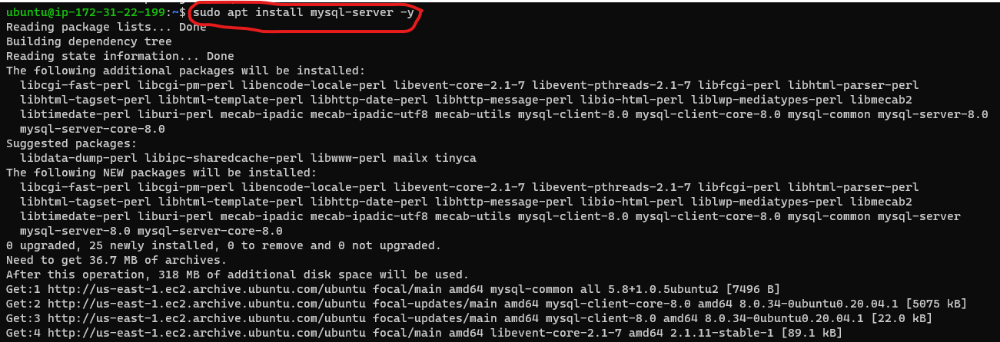
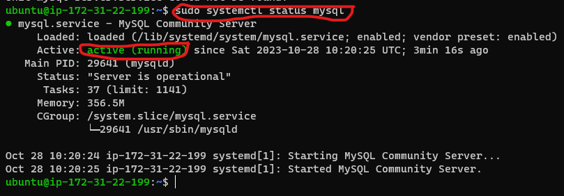
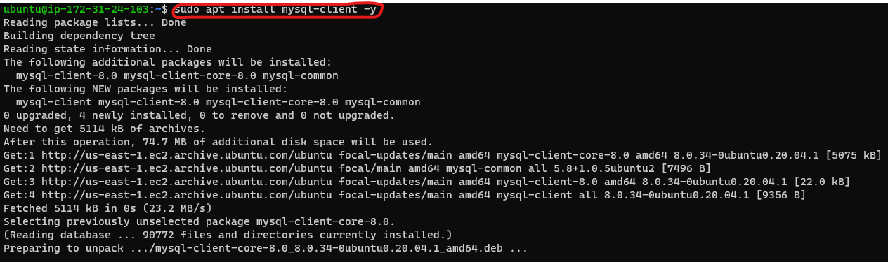
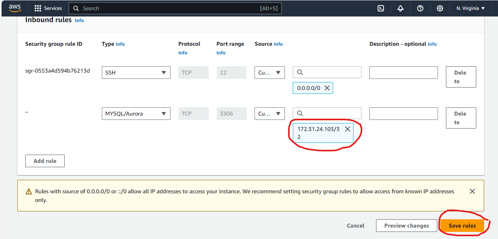
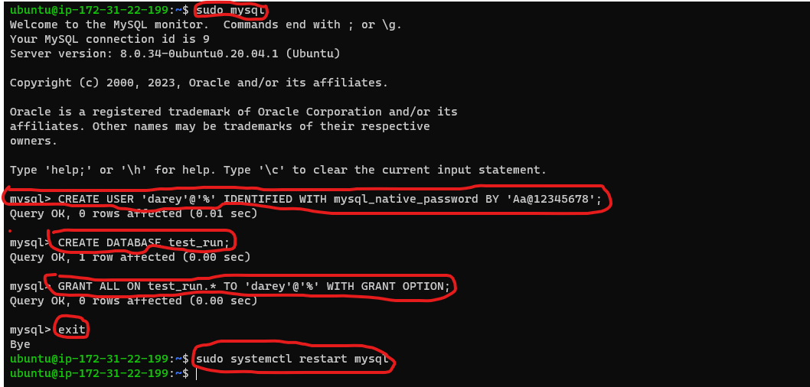
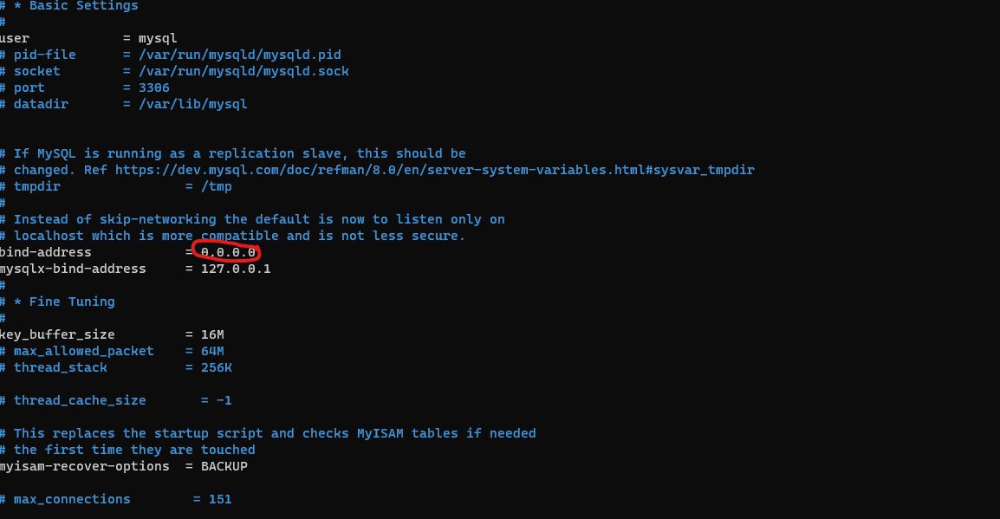

# Understanding Client Server Architecture With MySQL As RDBMS

# Introduction
When we talk the word client, it mean to talk of a person using a particular service. Similarly in the digital world a client can be a  computer or mobile phone capable of receiving information through a medium which can be a web browser or a terminal from a server.
The word server means a medium or a person that serves something. In the real world, a Server is a remote computer which provides information or access to particular services.

So it can basically be said that a client requests and a server respond. 

The image below shows a simple client server architecture.

As we proceed is this project, we will understand more about a [client server architecture](https://en.wikipedia.org/wiki/Client%E2%80%93server_model) and also implement a client server architecture with mysql as a relational database management system.

### Client Server Architecture With MySQL

MySQL is a relational database management system (RDBMS) developed by Oracle that is based on structured query language (SQL). Asw a devops engineer, a knowledge of a RDMS such as [MySQL](https://en.wikipedia.org/wiki/MySQL) is needed.

Now that we have an understanding of a client server architecture, a client server architecture with mysql means using mysql as a client as well as a server.

In some of our previous projects like LAMP and LEMP stack, we implemented, a client server architecture wherby our webserver is a client such that it sends a request to our database server to get a response (data). The architecture is shown inthe image below

### Why is a  Client Server Architecture With MySQL Important

A client-server system with MySQL is really important and needed to be engineered because it helps manage data efficiently and safely for a lot of different programs. By dividing the part that users see and use on their computers or devices from the part that manages the storage of information on a server, this design helps to make the system able to handle more users at the same time, as many users can use the database at once. The technology makes sure that data is safe, accurate, and stored in one place. It can be used in many industries like online shopping and healthcare. It is helpful when there is a lot of data that needs to be saved, accessed, and changed in an organized way. This helps to easily find, save, and change data at the same time.

### Target Audience

i. Software developers can learn about client-server architecture and MySQL to help them build applications that need a good way to store, find, and control data using a database server.

ii. Database administrators are people who can use this knowledge to make sure that MySQL databases work well and are safe and able to grow in a client-server setup.

iii. System administrators are people who are in charge of setting up, organizing, and taking care of server-client systems. They can make use of understanding the complexities of this structure to ensure smooth functioning and fix any problems.

iv. DevOps Engineers can use their knowledge of how clients and servers work together to automate the process of setting up, adjusting the size, and taking care of the software.

### Project Prerequisite

i. An AWS account

ii. Knowledege of [linux](http://linuxcommand.org/lc3_lts0020.php) and its commands.

iii SSH keys

In the project we will implement a client server architecture with mysql as a relational database management system

# Project Highlight

- Understanding Client Server Architecture With MySQL As RDBMS

- Introduction
  - Client Server Architecture With MySQL
  - Why Is A Client Server Architecture With MySQL Important
  - Target Audience
  - Project Prerequisites

- Implementing MySQL As A Client Server Architecture
  - Launching EC2 Instances
  - Updating and Upgrading Package Lists
  - Installing MySQL Server Software
  - Insatlling MySQL Client Software
  - Allowing Access To MySQL Server For MySQL Client
  - Create A New User and Database On MySQL Server
  - Grant MySQL Client Administrative Prilvledges
  - Configure MySQL Server To Allow Connection From Remote Host
  - Connecting To MySQL Server From MySQL Client

- Conclusion

# Implementing MySQL as a Client Server Architecture 

#### Step 1: Launch 2 EC2 Instances on AWS
i. Each instance should be named

- Instance 1 - mysql server

- Instance 2 - mysql client

ii. Open 2 terminals and ssh into both "mysql server" "mysql client"
- For windows users, open command prompt, powershell or git bash
- For mac and linux users, open a terminal and ssh into the instance

#### Step 2: Updating and Upgrading Package Lists and Apt Repositories
On both mysql server and mysql client update and upgrade package lists

    sudo apt update -y && sudo apt upgrade -y

**Note:** The command above should be executed for mysql server and mysql client instances

#### Step 3: Installing MySQL Server Software

On mysql server instance install MySQL Server software.

    sudo apt install mysql-server -y

  

To start mysql service

    sudo systemctl start mysql

Check is mysql is active and running

    sudo systemctl status mysql

#### Step 4: Installing MySQL Client Sofware 
On mysql client instance install MySQL Client software.

    sudo apt install mysql-client -y

  

#### Step 4: Allowing Access To MySQL Server for MySQl Client

By default, both of your EC2 virtual servers are located in the same local virtual network, so they can communicate to each other using local IP addresses.
Or, you can add them to the same subnets.

Use mysql server's local IP address to connect from mysql client. MySQL server uses TCP port 3306 by default, so you will have to open it by creating a new entry in ‘Inbound rules’ in ‘mysql server’ Security Groups. For extra security, do not allow all IP addresses to reach your ‘mysql server’ – allow access only to the specific local IP address of your ‘mysql client’.

#### Step 5: Create A New User and Database On MySQL Server 

In order for mysql client to be able to send request to mysql server, we need to create a new user for mysql client and a database.

i. Login to mysql server

    sudo mysql

ii Create a new user

    CREATE USER 'darey'@'%' IDENTIFIED WITH mysql_native_password BY 'password';
**Note:** The password field should be replaced wih your password

iii. Create a database

    CREATE DATABASE test_run;
    
#### Step 6: Grant MySQL Client Administrative Prilvledges
i. Grant privileges

    GRANT ALL ON test_run.* TO 'darey'@'%' WITH GRANT OPTION;

Exit MySQL and restart the mySQL service using

    sudo systemctl restart mysql

#### Step 7: Configure MySQL server to Allow Connections From Remote Hosts.
i. Edit mysql server configuration file

    sudo nano /etc/mysql/mysql.conf.d/mysqld.cnf

ii. Replace ‘127.0.0.1’ to ‘0.0.0.0’ like this:

In the mysqlserver configuration file, replace 127.0.0.1’ to ‘0.0.0.0, then save and close the file

#### Step 8: Connecting To Mysql Server From Mysql Client

i. Connect to mysql server from mysql client

    mysql -u darey -h <mysql_server_ipaddress> -p password
    
ii. Check that you have successfully connected to a remote MySQL server and can perform SQL queries

Client connection to mysql

    show databases;

If you see an output similar to the below image, then you have successfully completed this project – you have deloyed a fully functional MySQL Client-Server set up.

#### Task For The Project
Install install mysql and secure installation for mysql

# Conclusion
In summary, this project has looked into an important part of client-server architecture with MySQL. It has given a thorough understanding of how it works and its significance in today's computing. As a devops engineer or system aministrator, it's important to understand this architecture. It will help you improve how you access data, keep it secure, and make it scalable. As technology keeps advancing, this project helps people learn how to create strong and effective systems that connect computers and share information. This promotes new ideas and meets the needs of a world that relies on data. 

